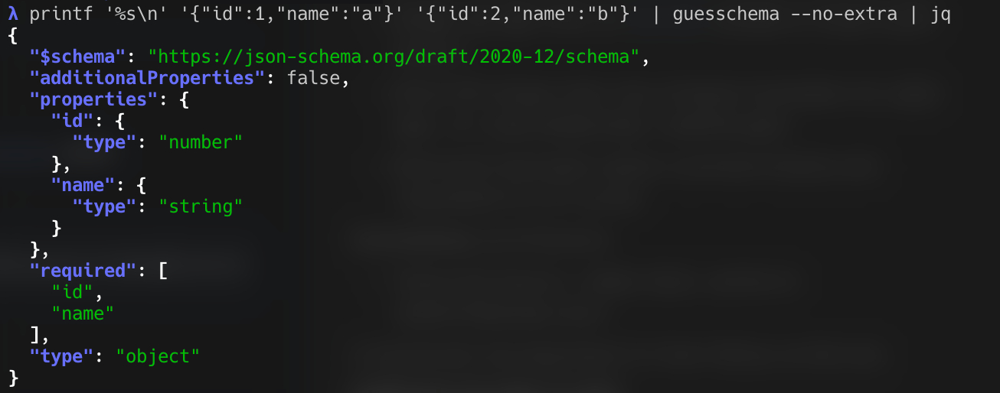

# guesschema



**guesschema** looks at many **JSON Lines** records (one JSON object per line) and **guesses** a **JSON Schema (draft 2020-12)** that describes what it has seen: field types, nesting, optional vs required fields (from how often keys appear), and sometimes `oneOf` when the same path carries conflicting types. It is a **bootstrap tool** for exploration, logging pipelines, and fixtures—not a guarantee that production data will always validate, and not a substitute for a hand-authored contract when you already know the model.

**CLI** — pipe JSONL into the binary and get one schema on stdout. Best when you are in a shell, notebook, or CI job and want a quick schema from a file or stream without writing code.

**Library** (`pkg/guesschema`) — same inference inside a Go program: bounded **`Run`** windows like the CLI, or **`NewAccumulator` / `BuildSchema`** when you already control the lines (tests, ETL steps, APIs). Best when guesschema is one step in your own service or toolchain.

## CLI

### Install

Pick a **`guesschema-<os>-<arch>`** binary from [Releases](https://github.com/Olian04/guesschema/releases) (with `checksums.txt` / SBOMs), or:

```bash
go install github.com/Olian04/guesschema/cmd/guesschema@latest
```

### Usage

Reads JSONL until **`--read-window`** elapses (default **1s**) or **EOF**, then prints one schema object. **Ctrl+C** stops reading or materialization and still prints the schema built so far.

```bash
printf '%s\n' '{"id":1,"name":"a"}' '{"id":2,"name":"b"}' | guesschema
```

### Flags

| Flag                             | Meaning                                                                       |
| -------------------------------- | ----------------------------------------------------------------------------- |
| `--read-window <duration>`       | Max time to read stdin (default **1s**).                                      |
| `--variant-threshold <float>`    | Same-path `oneOf` vs single winner; **T** in (0, 1), default **0.1**.         |
| `--no-extra`                     | Drop object keys starting with **`x-`** from output.                          |
| `--start-window-on-next-message` | Start the read window on first line (avoids empty-window emit on idle stdin). |
| `--debug`                        | Structured logs on stderr.                                                    |
| `-v` / `--version`               | Version info.                                                                 |

### Output

- **`$schema`**: `https://json-schema.org/draft/2020-12/schema`
- **`x-guesschema-generated-at`**, **`x-guesschema-invalid-json-lines`**
- Per-leaf **`x-guesschema-lines-with`**, **`x-guesschema-lines-total`**, **`x-guesschema-likelihood`** (unless **`--no-extra`**)
- Property paths: [RFC 6901](https://www.rfc-editor.org/rfc/rfc6901) pointers from each line’s root

---

## Library

`github.com/Olian04/guesschema/pkg/guesschema`

```bash
go get github.com/Olian04/guesschema/pkg/guesschema@latest
```

**`New` → `Guesser`** (immutable, concurrent **`Run`**). **`Run(ctx, r, w)`** mirrors the CLI read window. **`NewAccumulator` + `BuildSchema`** when you already have lines and do not need timing.

```go
g, err := guesschema.New(
    guesschema.WithReadWindow(time.Second),
    guesschema.WithVariantThreshold(0.1),
)
if err != nil {
    return err
}
var out bytes.Buffer
if err := g.Run(ctx, strings.NewReader("{\"a\":1}\n"), &out); err != nil {
    return err
}
```

```go
acc := guesschema.NewAccumulator()
for _, line := range lines {
    _ = acc.ObserveLine([]byte(line))
}
schema := guesschema.BuildSchema(acc, 0.1, time.Now().UTC())
```

Option godoc: **`pkg/guesschema`**. Examples: **`test/unit/pkg/guesschema/`**.

## Developing

Tests live only under **`test/`** (`test/unit/pkg/…` = library contract, `test/blackbox/…` = built CLI).

```bash
make test    # or: go test ./test/...
```

[docs/AGENTS.md](docs/AGENTS.md) · [docs/design/guesschema.md](docs/design/guesschema.md)
